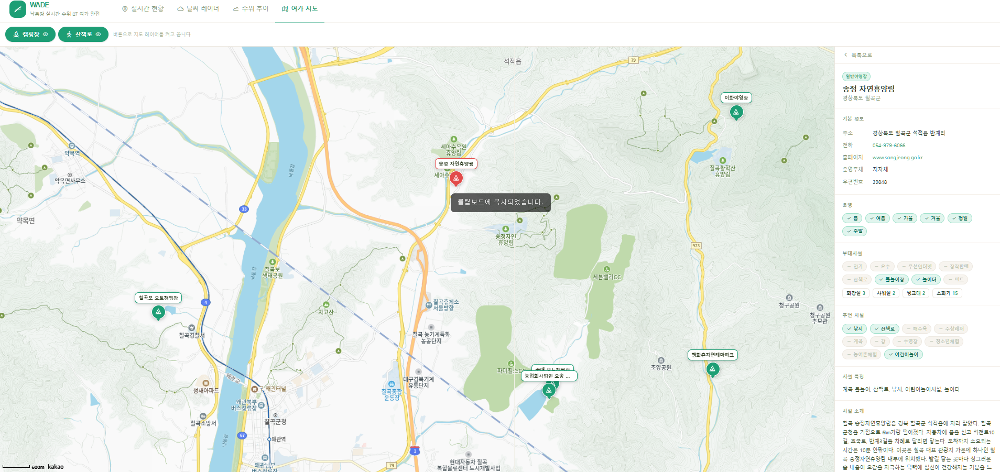
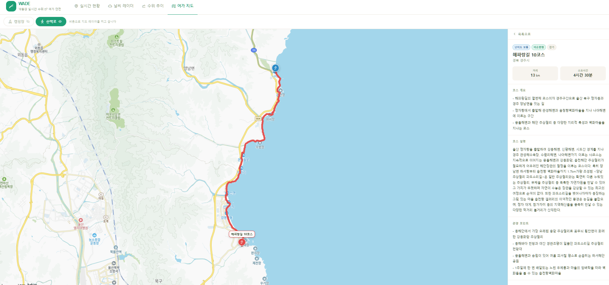

# WADE 고도화 작업 중간 보고서

| | |
|---|---|
| **작성일** | 2026.08.24 |
| **개발자** | 이승규 (1인 프로젝트) |
| **프로젝트명** | WADE (웨이드) |
| **고도화 기간** | 2026.08.11 ~ 2026.09.10 |
| **서비스 URL** | https://wade-flood.netlify.app |

---

## 1. 프로젝트 소개 및 해결하려는 문제

### 서비스 한 줄 소개

**낙동강 실시간 수위 모니터링 + 여가 지도 통합 서비스** — 수위 숫자가 아닌 "지금 가도 되는지"로 알려주는 앱

### 왜 만들었나

이전 직장에서 공공기관 전용 조기경보 시스템을 운영한 경험이 있다. 이 과정에서 두 가지 문제를 직접 목격했다.

**첫째, 시민은 수동적인 수신자였다.** 기관이 보내주는 알림을 받기 전까지 시민이 스스로 상황을 확인할 수단이 없었다.

**둘째, 수위 데이터는 공개되어 있지만 읽기 어려웠다.** 낙동강홍수통제소는 실시간 데이터를 공개하지만, "6.2m"라는 숫자가 위험한지 일반인이 판단하기 어렵다.

**WADE가 해결하는 것:** 낙동강 주변에서 캠핑·낚시·자전거·산책을 즐기는 사람들이 "지금 내가 가려는 장소가 안전한지" 직접 확인할 수 있게 한다. 수치 대신 "양포교 캠핑장 — 지금 주의 필요"처럼 장소 기반 언어로 번역한다.

---

## 2. 현재까지 구현·진행한 내용

### MVP 완료 (2026.06.15 ~ 07.01)

| 기능 | 설명 | 상태 |
|---|---|---|
| 실시간 현황 대시보드 | 카카오맵 수위 마커 + 관측소 카드 + AI 안전 안내 | ✅ |
| 수위 추이 탭 | Recharts 24시간 그래프 + 튜브 시각화 + 제방 단면도 | ✅ |
| 날씨·레이더 탭 | 기상청 레이더·위성·7일 예보 | ✅ |
| CCTV 스트리밍 | HLS 영상 모달 (hls.js 기반) | ✅ |
| 위험 경고 배너 | 관측소 위험 단계 도달 시 상단 배너 자동 노출 | ✅ |
| 모바일 반응형 | 지도 60vh 고정, CCTV/패널 lg 이상 표시 | ✅ |
| SEO 최적화 | 페이지별 meta 태그, og 이미지 | ✅ |

### v6 고도화 진행 현황 (2026.08.11 ~ 현재)

| 기능 | 설명 | 상태 |
|---|---|---|
| WBS / 마일스톤 수립 | 23세션 기준 날짜별 작업 계획 | ✅ |
| PRD v6 개정 | 여가지도 실연동·회원·관리자·문의 섹션 추가 | ✅ |
| 여가지도 캠핑장 실연동 | 고캠핑 DB 연동 — 낙동강 주변 실제 캠핑장 마커 표시 | ✅ |
| 여가지도 산책로 Polyline | 두루누비 GPX 적재 — 산책로 경로를 선(Polyline)으로 표시 | ✅ |
| 산책로 지역 필터 | 시/도 단위 필터 버튼, 기본값 경북 자동 선택 | ✅ |
| 캠핑장·산책로 상세 패널 | 클릭 시 편의시설·거리·소요시간 등 상세 정보 표시 | ✅ |
| CCTV 낮/밤 사진 매핑 | cctvname 매칭 + 18시 기준 낮/밤 분기 | 🔄 W3 진행중 |
| 카카오 OAuth 로그인 | 카카오 계정 간편 로그인 + JWT | 🔄 W3 예정 |
| 마이페이지 / 즐겨찾기 | 내 정보 + 캠핑장 즐겨찾기 | ⏳ W4 |
| 관리자 / 문의 CRUD | role 인가 + 사용자 목록 + 문의 답변 | ⏳ W4 |

---

## 3. 현재 결과물

### 3.1 실시간 현황 대시보드

<!-- 이미지 삽입 -->

### 3.2 수위 추이 탭 — Recharts 그래프 + 튜브 시각화

<!-- 이미지 삽입 -->

### 3.3 여가지도 — 캠핑장 실연동 (고캠핑 공공데이터 DB 적재)

낙동강 주변 실제 캠핑장 데이터를 고캠핑 공공 API에서 수집해 DB에 1회 적재 후, 카카오맵 CustomOverlay로 마커를 표시한다. 마커 클릭 시 편의시설·주소·운영 정보를 담은 상세 패널이 우측에 표시된다.



### 3.4 여가지도 — 산책로 Polyline (두루누비 GPX 적재)

두루누비 공공데이터의 GPX 파일을 파싱해 DB에 적재하고, 카카오맵 Polyline으로 산책로 경로를 선으로 표시한다. 시/도 단위 지역 필터를 제공하며, 기본값은 서비스 대상 지역인 경북으로 자동 선택된다.



### 3.5 CCTV 스트리밍 모달

<!-- 이미지 삽입 -->

---

## 4. 사용 기술 및 주요 기술 선택 이유

### 프론트엔드

| 기술 | 버전 | 선택 이유 |
|---|---|---|
| React | 19 | 최신 Concurrent 기능, 생태계 안정성 |
| TypeScript | 6 (strict) | 컴파일 타임 오류 차단, 리팩터링 안정성 |
| Vite | 8 | HMR 속도, 번들 성능 |
| **TanStack Query v5** | v5 | 서버 상태 캐싱 + 10분 자동 폴링 + 마지막 성공 데이터 유지 (`placeholderData`) |
| Zustand | v5 | UI 상태(모달 열림, 선택 마커)만 담당 — 서버 상태는 Query가 전담 |
| **Tailwind CSS v4** | v4 | CSS-first 설정 (`@theme` 블록, config 파일 없음), 브랜드 컬러 토큰화 |
| Recharts | v3 | 수위 추이 그래프, 커스텀 튜브 시각화 |
| Kakao Maps JS API | - | 국내 지도 데이터 정확도, CustomOverlay 자유도 |
| hls.js | - | HLS 스트림(낙동강홍수통제소 CCTV) 브라우저 재생 |

#### TanStack Query를 선택한 이유 (상세)

수위 데이터는 10분마다 갱신되는 실시간 데이터다. 단순 `useEffect + fetch`로는 폴링 관리, 로딩/에러 상태, 캐시 만료, 컴포넌트 언마운트 시 취소 등을 직접 구현해야 한다. TanStack Query는 이를 `refetchInterval: 600_000` 한 줄로 해결하고, API 오류 시 `placeholderData`로 마지막 성공 데이터를 유지할 수 있어 "연결 실패에도 안전한" 서비스 원칙을 지킬 수 있다.

### 백엔드

| 기술 | 선택 이유 |
|---|---|
| Spring Boot | 공공데이터 API 연동 경험 있음, 스케줄링(`@Scheduled`) 내장 |
| MyBatis | SQL 직접 제어 선호 — 복잡한 조인 쿼리 가독성 |
| PostgreSQL (Neon) | jsonb 타입으로 GPX 좌표 배열 저장, 프리티어 충분 |
| Caffeine Cache | AI 안내 응답 10분 인메모리 캐싱 (Claude API 비용 절감) |

### 외부 API

| API | 용도 |
|---|---|
| 낙동강홍수통제소 | 실시간 수위 데이터 (10분 주기) |
| 기상청 초단기예보 | 기온·강수확률 |
| 기상청 레이더 이미지 | 강수·위성·태풍 레이더 embed |
| 카카오맵 JS API | 여가 지도 마커·Polyline |
| Claude API (Anthropic) | 자연어 안전 안내 생성 |
| 국가교통정보센터 ITS | CCTV 메타데이터 (스트림 URL 조회) |
| 고캠핑 공공데이터 | 낙동강 주변 캠핑장 정보 (1회 적재) |
| 두루누비 공공데이터 | 산책로 GPX 경로 (1회 적재) |

---

## 5. 진행 과정에서 어려웠던 점과 해결한 내용

### 5.1 KakaoMap CustomOverlay 클릭 이벤트 버그

**상황:** 대시보드 지도에서 CCTV 마커를 클릭해도 모달이 열리지 않는 버그.

**원인 분석:** `CustomOverlay`에 HTML 문자열로 content를 전달하면 `overlay.getContent()`가 DOM 요소가 아닌 원본 HTML **문자열**을 반환한다. 때문에 `typeof el !== 'string'` 조건이 항상 `false`가 되어 클릭 리스너가 절대 등록되지 않았다.

```js
// 문제 코드
const overlay = new kakao.maps.CustomOverlay({ content: '<div>...</div>' })
const el = overlay.getContent()  // → 문자열 반환
if (typeof el !== 'string') {    // → 항상 false, 리스너 등록 안 됨
  el.addEventListener('click', handler)
}
```

**해결:** content를 문자열이 아닌 `document.createElement()`로 만든 **DOM 요소**로 전달. 리스너를 CustomOverlay 생성 전에 직접 attach.

```js
const el = document.createElement('div')
el.innerHTML = `...마커 HTML...`
el.addEventListener('click', () => onCctvClick(cctv))  // DOM 직접 등록

new kakao.maps.CustomOverlay({ content: el, ... })  // DOM 요소로 전달
```

---

### 5.2 CCTV 스트리밍 Mixed Content 차단

**상황:** 낙동강홍수통제소 CCTV API가 내려주는 스트림 URL이 `http://` 프로토콜이었고, 배포 환경(HTTPS)에서 브라우저가 Mixed Content 정책으로 전부 차단함.

**원인:** ITS API 응답의 `cctvurl` 필드 값이 `http://cctvsec.ktict.co.kr/...` 형태.

**해결:** API 응답을 가공하는 시점에 URL 프로토콜을 강제 변환.

```ts
// src/api/cctv.ts
streamUrl: item.cctvurl
  ? (item.cctvurl as string).replace('http://', 'https://')
  : null
```

---

### 5.3 국가교통정보센터 외국 IP 차단

**상황:** Netlify 배포 서버에서 ITS CCTV API 호출 시 응답이 없는 현상. 로컬에서는 정상 동작.

**원인:** `openapi.its.go.kr`가 해외 IP(Netlify CDN 서버)에서의 요청을 차단.

**해결:** Netlify 서버를 통한 프록시 방식을 포기하고, **브라우저에서 직접 호출**하는 방식으로 전환. 접속자 IP(한국)로 요청이 나가므로 차단 우회.

---

### 5.4 여가지도 패널 stuck 버그 — null 값 매칭

**상황:** 산책로를 선택하지 않은 상태에서 여가지도 사이드 패널이 특정 산책로 상세로 고정되어 목록으로 돌아갈 수 없는 버그.

**원인:** DB에 `courseId`가 null인 산책로 데이터가 있었고, 초기 상태 `selectedTrailId = null`과 `null === null`이 매칭되어 의도치 않게 상세 패널이 노출됨.

```js
// 문제 코드
const selectedTrail = trails.find(t => t.courseId === selectedTrailId)
// selectedTrailId=null, t.courseId=null → 즉시 매칭
```

**해결:** 명시적 null 가드 추가.

```js
const selectedTrail = selectedTrailId != null
  ? trails.find(t => t.courseId === selectedTrailId)
  : undefined
```

---

### 5.5 캠핑장 마커 이름 null 표시

**상황:** 지도 위 캠핑장 마커 라벨이 실제 캠핑장명 대신 "null"로 표시됨. DB에는 `facility_name` 컬럼에 데이터가 있음.

**원인:** Spring Boot 백엔드가 JSON을 `facility_name`(snake_case)으로 내려주는데, 프론트엔드 인터페이스는 `facilityName`(camelCase)으로 정의되어 있어 값이 `undefined` → 템플릿 리터럴에서 `"null"` 문자열로 출력됨.

**해결:** API 레이어에서 응답 가공 시 양쪽 케이스를 모두 대응.

```ts
// src/api/camping.ts
return data.map(item => ({
  ...item,
  facilityName: item.facilityName ?? item.facility_name ?? null,
}))
```

---

## 6. 현재 고민 중인 부분 / 피드백받고 싶은 부분

### 6.1 카카오 OAuth 최초 구현

이번 프로젝트에서 처음으로 OAuth 2.0 소셜 로그인을 구현한다. 인가 코드 → 토큰 교환 → 사용자 정보 조회 → JWT 발급 흐름을 Spring Boot에서 직접 구현하는 것이 처음이라, 세션/토큰 전략(쿠키 vs 메모리)과 토큰 갱신 시점 설계에 대한 피드백이 있으면 좋겠다.

### 6.2 공공데이터 1회 적재 방식의 적합성

캠핑장·산책로 데이터는 "정적 데이터"로 판단해 공공 API에서 1회 수집 후 DB에 seed하는 방식을 선택했다. 실시간 폴링이 아니므로 API 키 소모가 없고 응답 속도가 빠르다는 장점이 있다. 다만 공공 데이터가 업데이트됐을 때 반영이 안 된다는 단점이 있다. 주기적 배치 갱신 vs 수동 재적재 중 어떤 방향이 더 적절한지 의견이 궁금하다.

### 6.3 여가지도 UX — 지역 필터 기본값

현재 산책로 레이어를 켜면 경북(경상북도) 지역이 기본 선택된다. 서비스 대상 지역이 구미·칠곡이라 합리적이지만, 전국 데이터를 기본으로 보여주는 것도 고려 중이다.

---

## 7. 향후 구현·개선 계획

### W3 남은 일정 (08/25~08/28)

| 날짜 | 작업 |
|---|---|
| 08/25~26 | CCTV 낮/밤 사진 수집·적재 + cctvname 매핑 + 18시 기준 분기 |
| 08/27~28 | 카카오 OAuth 백엔드 (인가코드 → JWT) + 프론트 로그인 화면 |

### W4 (08/31~09/04)

| 기능 | 설명 |
|---|---|
| 마이페이지 | 내 정보 + 즐겨찾기 목록 + 내 문의 |
| 즐겨찾기 | 캠핑장 즐겨찾기 추가/삭제, 마이페이지 연동 |
| 관리자 | role 인가, 사용자 목록 + 문의 전체 조회·답변 |
| 문의 CRUD | 작성 / 내 문의 목록 / 관리자 답변 |

### 마감 (09/07~09/10)

- Core 통합 QA (시나리오: 비회원 → 로그인 → 여가지도 → 즐겨찾기 → 문의 → 관리자 답변)
- Vercel + Railway 배포 최종 확인
- README·API 문서 최신화

### 향후 백로그

| 순서 | 기능 | 설명 |
|---|---|---|
| 1 | 웹소켓 실시간 문의 | 비실시간 CRUD 위에 STOMP 채팅 추가 |
| 2 | 캠핑장 예약·결제 | 포트원/토스 테스트 결제 연동 |
| 3 | 지역 확장 | 합천·창녕·부산 구간 추가 |
| 4 | 데이터 자동 동기화 | 공공데이터 주기적 배치 갱신 |

---

## 8. GitHub Repository 링크

| 저장소 | 링크 |
|---|---|
| 프론트엔드 (wade) | [링크 삽입] |
| 백엔드 (wade-api) | [링크 삽입] |
| 배포 (Netlify/Vercel) | [링크 삽입] |
